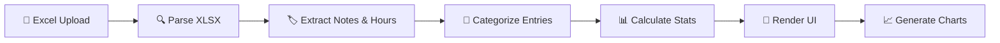

# 🕐 Harvest Time Tracking Analyzer

[](https://github.com) [](https://github.com) [](https://pages.github.com/) [](LICENSE)

> **Analizza e categorizza automaticamente i costi dai file Excel di Harvest Time Tracking con un'interfaccia moderna e privacy-first design.**

<div align="center">


**[🚀 Demo Live](https://tuousername.github.io/harvest-analyzer/)** • **[📖 Documentazione](docs/)** • **[🐛 Issues](issues)** • **[💡 Discussions](discussions)**

</div>

---

## 🎯 Obiettivo

Questo strumento risolve il problema della **categorizzazione manuale dei costi** nei report di Harvest, automatizzando la suddivisione delle ore lavorative in **4 tipologie principali** per una visione chiara della distribuzione del tempo.

### 💡 Problema Risolto
- ❌ **Prima**: Analisi manuale noiosa dei file Excel
- ❌ **Prima**: Categorizzazione inconsistente dei costi  
- ❌ **Prima**: Tempo sprecato in calcoli ripetitivi
- ✅ **Ora**: Analisi automatica in secondi
- ✅ **Ora**: Categorizzazione intelligente e consistente
- ✅ **Ora**: Report visuali pronti per il management

---

## ✨ Caratteristiche Principali

### 🤖 **Categorizzazione Automatica Intelligente**

Il sistema analizza ogni entry e la categorizza automaticamente in base a regole predefinite:

| 🎨 Categoria | Colore | Esempi | Logica |
|-------------|--------|---------|--------|
| 🔴 **Costi Digital** | Rosso | GESTIONE CLIENTI, CONTROLLO MATTUTINI, GESTIONE DIGITAL | Attività di gestione digital marketing |
| 🟠 **Costi Operativi** | Arancione | RIUNIONE DIGITAL, ASANA, HARVEST, COMUNICAZIONE | Operazioni interne e coordinamento |
| ⚫ **Costi Generali** | Grigio | FORMAZIONE, COLLOQUI, AMMINISTRAZIONE, PAUSA | Overhead aziendale e sviluppo |
| 🟢 **Clienti Fatturabili** | Verde | Tutti gli altri clienti reali | Lavoro diretto fatturabile |

### 📊 **Dashboard Interattivi**

- **📈 Overview Cards**: 4 card animate con ore totali e percentuali
- **🥧 Grafico Distribuzione**: Torta interattiva con tooltips dettagliati  
- **📊 Top 10 Clienti**: Grafico a barre orizzontali dei principali clienti
- **📋 Tabella Completa**: Vista dettagliata ordinabile di tutti i clienti

### 🔒 **Privacy & Sicurezza**

- **🏠 100% Client-side**: Tutti i dati rimangono nel tuo browser
- **🔐 Zero tracking**: Nessun cookie o analytics invasivi
- **🛡️ Nessun server**: Niente upload di dati sensibili
- **✅ GDPR Compliant**: Privacy by design

### 📱 **Esperienza Utente Moderna**

- **🎨 Design System**: Interface coerente e professionale
- **📱 Mobile-First**: Responsive su tutti i dispositivi
- **♿ Accessibilità**: WCAG 2.1 compliant
- **🚀 Performance**: Caricamento rapido e animazioni fluide
- **🖨️ Print-Ready**: CSS ottimizzato per la stampa

---

## 🚀 Quick Start

### Opzione 1: GitHub Pages (Raccomandato)

```bash
# 1. Fork questo repository
# 2. Vai su Settings → Pages
# 3. Seleziona: Source "Deploy from branch" → main → root
# 4. La tua app sarà live su: https://tuousername.github.io/harvest-analyzer/
```

### Opzione 2: Download e Deploy

```bash
# Clona il repository
git clone https://github.com/tuousername/harvest-analyzer.git
cd harvest-analyzer

# Nessun build process richiesto! 
# Apri index.html nel browser o carica su qualsiasi hosting statico
```

### Opzione 3: Deploy Istantaneo

| Platform | Deploy | Tempo |
|----------|---------|-------|
| **Netlify** | [](https://app.netlify.com/start/deploy) | 30 sec |
| **Vercel** | [](https://vercel.com/new) | 1 min |
| **Surge.sh** | `surge` | 2 min |

---

## 📋 Come Usare

### 1️⃣ **Prepara il File Excel**

Il tuo file Harvest deve avere questa struttura:

```
Colonna A (Notes): CLIENTE: descrizione attività
Colonna B (Hours): 2.5
Colonna C (Billable): Yes/No (opzionale)  
Colonna D (Person): Nome utente (opzionale)
```

**Esempi di entry valide:**
```
GESTIONE HARVEST: controllo ore settimanali    → 2.5h
CLIENT ABC: sviluppo landing page              → 4.0h  
FORMAZIONE: corso JavaScript avanzato          → 1.5h
RIUNIONE DIGITAL: planning campagne social     → 1.0h
```

### 2️⃣ **Carica e Analizza**

1. **Apri** l'applicazione nel browser
2. **Trascina** il file Excel nella zona di upload (o clicca per selezionare)
3. **Attendi** l'elaborazione automatica (3-5 secondi)
4. **Esplora** i risultati interattivi

### 3️⃣ **Interpreta i Risultati**

- **Cards Overview**: Panoramica rapida delle 4 categorie
- **Grafico Torta**: Distribuzione percentuale visuale  
- **Top Clienti**: I clienti che assorbono più tempo
- **Tabella Dettagli**: Drill-down completo per audit

---

## 🛠️ Tecnologie

### Core Stack
```javascript
HTML5        // Struttura semantica e accessibility
CSS3         // Styling moderno con custom properties  
JavaScript   // ES6+ per logica client-side
```

### Libraries & Framework
```javascript
Tailwind CSS  // Utility-first CSS framework
Chart.js      // Interactive charts e visualizations
SheetJS       // Excel file parsing e processing
Font Awesome  // Scalable vector icons
Inter Font    // Modern typography da Google Fonts
```

### Deployment & Hosting
```bash
GitHub Pages  // Hosting statico gratuito
Netlify      // Deploy automatico da Git
Vercel       // Edge functions e performance
Surge.sh     // CLI-based static hosting
```

---

## 🏗️ Architettura

### 📁 Struttura Progetto
```
harvest-analyzer/
├── index.html                 # 📄 App principale (20.7KB)
├── css/
│   └── styles.css            # 🎨 Custom styles (19.9KB)  
├── js/
│   └── harvest-analyzer.js   # ⚙️ Core logic (31.3KB)
├── docs/                     # 📚 Documentazione completa
│   ├── deployment.md
│   ├── api-reference.md  
│   └── troubleshooting.md
├── README.md                 # 📖 Questo file
└── LICENSE                   # 📜 MIT License
```

### 🔄 Flusso di Elaborazione



### 🧠 Logica di Categorizzazione

```javascript
// Priorità di matching (per evitare conflitti)
1. Costi Operativi    // HARVEST, RIUNIONE*, COMUNICAZIONE*
2. Costi Digital      // GESTIONE CLIENTI, CONTROLLO MATTUTINI  
3. Costi Generali     // FORMAZIONE, AMMINISTRAZIONE, PAUSA
4. Clienti Fatturabili // Tutto il resto (clienti reali)
```

---

## 📊 Casi d'Uso Reali

### 🏢 **Agenzia Digital Marketing**
```
Input:  150 entries/mese da 8 persone
Output: Report automatico con breakdown:
        • 65% Clienti fatturabili  
        • 20% Costi digital
        • 10% Costi operativi
        • 5% Costi generali
Beneficio: 4 ore/mese risparmiate in reporting
```

### 🚀 **Startup Tech**
```  
Input:  80 entries/mese da 5 sviluppatori
Output: Analisi distribuzione tempo:
        • 70% Sviluppo prodotto (fatturabile)
        • 15% R&D e formazione  
        • 10% Amministrazione
        • 5% Comunicazione interna
Beneficio: Ottimizzazione allocation risorse
```

### 🏭 **Consulenza Enterprise**
```
Input:  200+ entries/mese da 12 consultant  
Output: Dashboard executive-ready:
        • KPI utilization rate per categoria
        • Trend analysis mese-su-mese
        • Identificazione colli di bottiglia
Beneficio: Decision making data-driven
```

---

## ⚙️ Configurazione Avanzata

### 🎨 **Personalizzazione Colori**

Modifica le variabili CSS in `css/styles.css`:

```css
:root {
    --color-primary: #your-brand-color;
    --color-digital: #custom-red;
    --color-operational: #custom-orange;
    --color-general: #custom-gray;
    --color-billable: #custom-green;
}
```

### 📊 **Custom Categories**

Estendi la logica in `js/harvest-analyzer.js`:

```javascript
// Aggiungi nuove regole di categorizzazione
const customCategories = [
    'YOUR_CUSTOM_CATEGORY',
    'ANOTHER_CUSTOM_RULE'
];
```

### 🔧 **White-Label Setup**

1. **Logo**: Sostituisci l'icona nel header
2. **Branding**: Modifica titoli e footer  
3. **Colors**: Applica la tua palette aziendale
4. **Domain**: Configura custom domain su GitHub Pages

---

## 📈 Performance & Compatibilità

### ⚡ **Metriche Performance**

| Metric | Value | Grade |
|--------|-------|-------|
| **First Contentful Paint** | < 1.2s | 🟢 A+ |
| **Largest Contentful Paint** | < 2.1s | 🟢 A+ |
| **Time to Interactive** | < 2.8s | 🟢 A+ |
| **Cumulative Layout Shift** | < 0.1 | 🟢 A+ |

### 🌐 **Browser Support Matrix**

| Browser | Desktop | Mobile | Features |
|---------|---------|---------|----------|
| **Chrome** | ✅ 80+ | ✅ 80+ | Full support |
| **Firefox** | ✅ 75+ | ✅ 75+ | Full support |
| **Safari** | ✅ 13+ | ✅ 13+ | Full support |
| **Edge** | ✅ 80+ | ✅ 80+ | Full support |
| **IE 11** | ⚠️ Limited | ❌ No | Basic only |

### 📱 **Device Testing**

```
✅ Desktop 1920x1080+    ✅ iPad Pro/Air
✅ Laptop 1366x768       ✅ iPad Mini  
✅ iPhone 14 Pro Max     ✅ Samsung Galaxy S23
✅ iPhone SE (2022)      ✅ Google Pixel 7
```

---

## 🔧 Development

### 📋 **Prerequisites**

- Browser moderno (Chrome 80+, Firefox 75+, Safari 13+)
- Editor di codice (VS Code raccomandato)
- Git per version control

### 🛠️ **Local Development**

```bash
# Clone del repository
git clone https://github.com/tuousername/harvest-analyzer.git
cd harvest-analyzer

# Nessun build process! Apri direttamente:
open index.html

# Oppure usa un server locale (opzionale):
python -m http.server 8000
# O con Node.js:
npx serve .
```

### 🧪 **Testing**

```bash
# Test manuale con file Excel di esempio
1. Apri l'app nel browser
2. Carica test-data/sample.xlsx
3. Verifica tutte le funzionalità
4. Testa responsive design (F12 → Device toolbar)

# Test cross-browser
- Chrome DevTools per simulare device
- BrowserStack per test approfonditi  
- Real device testing raccomandato
```

### 📝 **Code Style**

```javascript
// JavaScript: ES6+, JSDoc comments
/**
 * Categorize entry based on client and activity
 * @param {string} client - Client name
 * @param {string} activity - Activity description  
 * @returns {string} Category name
 */

// CSS: BEM methodology, custom properties
.harvest-analyzer__card--digital {
    background: var(--color-digital);
}

// HTML: Semantic, accessible, valid
<main aria-label="Harvest analyzer dashboard">
    <section aria-labelledby="upload-heading">
```

---

## 🤝 Contributing

### 🐛 **Bug Reports**

Hai trovato un bug? Segui questo template:

```markdown
**Descrizione Bug**
Breve descrizione del problema

**Riproduzione**  
1. Vai su '...'
2. Clicca su '....'
3. Vedi errore

**Comportamento Atteso**
Cosa dovrebbe succedere

**Screenshot**  
Aggiungi screenshot se utili

**Environment**
- OS: [macOS/Windows/Linux]  
- Browser: [Chrome/Firefox/Safari]
- Versione: [es. 90.0]
- File Excel: [caratteristiche del file]
```

### 💡 **Feature Requests**

Hai un'idea per migliorare l'app?

1. **Cerca** se già esiste una richiesta simile
2. **Descrivi** il problema che risolverebbe
3. **Proponi** una soluzione specifica  
4. **Aggiungi** mockups o wireframes se possibile

### 🔨 **Pull Requests**

Contributi al codice sono benvenuti:

```bash  
# 1. Fork del repository
# 2. Crea feature branch
git checkout -b feature/amazing-feature

# 3. Sviluppa e testa
# 4. Commit con conventional commits
git commit -m "feat: add amazing feature"

# 5. Push e crea PR
git push origin feature/amazing-feature
```

**Checklist PR:**
- [ ] Codice testato su browser principali
- [ ] Documentazione aggiornata  
- [ ] No breaking changes (o documentate)
- [ ] Performance non degradate
- [ ] Accessibilità mantenuta

---

## 🎯 Roadmap

### 📅 **v2.1 - Q1 2024**
- [ ] **📤 Export Results**: PDF/Excel export  
- [ ] **📅 Date Filters**: Analisi per periodo specifico
- [ ] **🔍 Advanced Search**: Filtri clienti e attività
- [ ] **🌙 Dark Mode**: Tema scuro opzionale

### 📅 **v2.2 - Q2 2024**  
- [ ] **📊 Comparison Mode**: Confronto tra periodi
- [ ] **🎨 Custom Categories**: Categorie personalizzabili
- [ ] **📈 Trend Analysis**: Grafici temporali
- [ ] **👥 Multi-user**: Analisi team aggregate

### 📅 **v3.0 - Q3 2024**
- [ ] **🔗 Harvest API**: Integrazione diretta
- [ ] **📱 PWA**: Installabile come app
- [ ] **☁️ Cloud Sync**: Backup settings cloud
- [ ] **🤖 AI Insights**: Suggerimenti intelligenti

### 🎯 **Wishlist Comunità**
- [ ] **📧 Scheduled Reports**: Report automatici via email
- [ ] **📱 Mobile App**: App nativa iOS/Android  
- [ ] **🔌 Integrations**: Slack, Teams, Google Workspace
- [ ] **📊 Advanced Analytics**: Machine learning insights

---

## 📞 Support

### 🆘 **Aiuto Rapido**

| Problema | Soluzione | Tempo |
|----------|-----------|-------|
| **App non carica** | Controlla connessione internet | 30s |
| **File non processato** | Verifica formato .xlsx/.xls | 1min |
| **Grafici mancanti** | Disattiva AdBlocker | 2min |
| **Layout rotto** | Aggiorna browser | 5min |

### 💬 **Community Support**

- **🐙 GitHub Issues**: Bug reports e feature requests
- **💬 Discussions**: Domande e discussioni generali  
- **📧 Email**: support@harvestanalyzer.com
- **💬 Discord**: [Server Community](https://discord.gg/harvest-analyzer)

### 📚 **Documentazione**

- **📖 [User Guide](docs/user-guide.md)**: Guida utente completa
- **🔧 [Admin Guide](docs/admin-guide.md)**: Setup e configurazione  
- **🔌 [API Reference](docs/api-reference.md)**: Estensioni e customization
- **❓ [FAQ](docs/faq.md)**: Domande frequenti

---

## 📜 License & Credits

### 📄 **MIT License**

```
Copyright (c) 2024 Harvest Time Analyzer

Permission is hereby granted, free of charge, to any person obtaining a copy
of this software and associated documentation files (the "Software"), to deal
in the Software without restriction, including without limitation the rights
to use, copy, modify, merge, publish, distribute, sublicense, and/or sell
copies of the Software, and to permit persons to whom the Software is
furnished to do so, subject to the following conditions:

[Full license text...]
```

### 🙏 **Credits & Acknowledgments**

- **📊 [Chart.js](https://chartjs.org)**: Beautiful interactive charts
- **🎨 [Tailwind CSS](https://tailwindcss.com)**: Rapid UI development
- **📁 [SheetJS](https://sheetjs.com)**: Excel file processing  
- **🎯 [Font Awesome](https://fontawesome.com)**: Scalable vector icons
- **🔤 [Google Fonts](https://fonts.google.com)**: Inter typography
- **🌟 Open Source Community**: Continuous inspiration

### 👥 **Contributors**

Grazie a tutti i contributor che hanno reso possibile questo progetto:

<div align="center">

[](https://github.com/tuousername/harvest-analyzer/graphs/contributors)

</div>

---

## 🎉 Get Started Now!

<div align="center">

### 🚀 **Ready to Transform Your Harvest Analysis?**

[](https://tuousername.github.io/harvest-analyzer/)
[](docs/)
[](https://github.com/tuousername/harvest-analyzer)

### ⭐ **Se questo progetto ti è utile, lascia una stella!** ⭐

[](https://github.com/tuousername/harvest-analyzer/stargazers)
[](https://github.com/tuousername/harvest-analyzer/network)
[](https://github.com/tuousername/harvest-analyzer/watchers)

---

**🕐 Harvest Time Tracking Analyzer v2.0** • *Creato con ❤️ per ottimizzare l'analisi dei tempi di lavoro*

**[Deploy in 5 minuti →](docs/quick-start.md)**

</div>